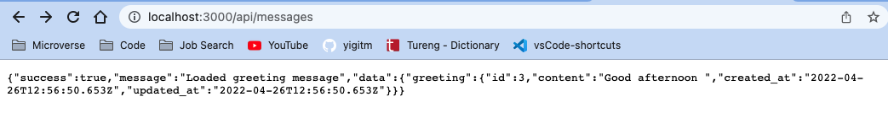
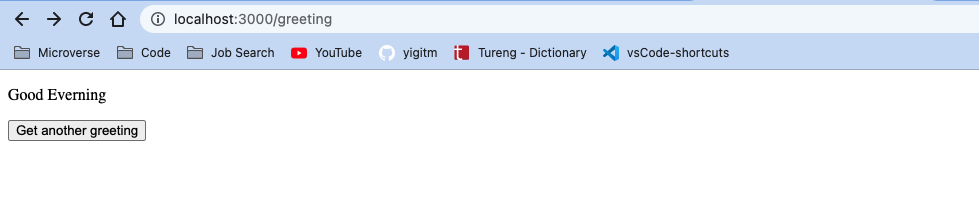

# Rails-React App

> This app consists of implementing a connection between a Ruby on Rails back-end and React front-end. Practicing the pros and cons of different approaches of connecting Ruby on Rails back-end with React front-end.



> It allows you to build React components as a part of your Rails JavaScript and serve it in a component, react_component, to be used in a regular ERB file by creating random greeting messages.



## Built With

- Ruby
- Rails
- React
- Redux
- Thunk
- Axios
- Rubocop

## Getting Started

To get a local copy up and running follow these simple example steps.

### Prerequisites

Ruby should be installed in your local machine. Please check this [article](https://www.theodinproject.com/lessons/ruby-installing-ruby) how to install/setup Ruby for different operating systems.

Ruby on Rails should be installed in your local machine. Please check this [article](https://www.theodinproject.com/lessons/ruby-on-rails-installing-rails) how to install/setup Ruby for different operating systems.

### Setup

To get a local copy of the repository please run the following commands on your terminal.

If you are not familiar to use terminal, please check this [article](https://www.theodinproject.com/courses/web-development-101/lessons/command-line-basics-web-development-101)

### Install

Open your terminal & go to your desktop.

```
cd your_desktop
```

Run below commands.

```
git clone https://github.com/yigitm/budget-app.git
```

### Usage

Go to the app folder.

```
cd hello-rails-react
```

Run below command to install packages that app is depended to run.

```
bundle install
```

Run below to set database

```
rails db:create
rails db:migrate
rails db:seed
```

Run below for React packages

```
npm i
yarn install
```

Run the local Rails server in your default browser with below command.

```
rails s
```

## Author

👤 **Yigit Mersin**

- GitHub: [@ygtmrsn](https://github.com/ygtmrsn)
- Twitter: [@ygtmrsn](https://twitter.com/ygtmrsn)
- LinkedIn: [yigitmersin](linkedin.com/in/yigitmersin)

## 🤝 Contributing

Contributions, issues, and feature requests are welcome!

Feel free to check the [issues page](https://github.com/yigitm/hello-rails-react/issues).

## Show your support

Give a ⭐️ if you like this project!

## Acknowledgments

- Microverse
- Open source

## 📝 Licenses

This project is [MIT](https://github.com/git/git-scm.com/blob/main/MIT-LICENSE.txt) licensed.
